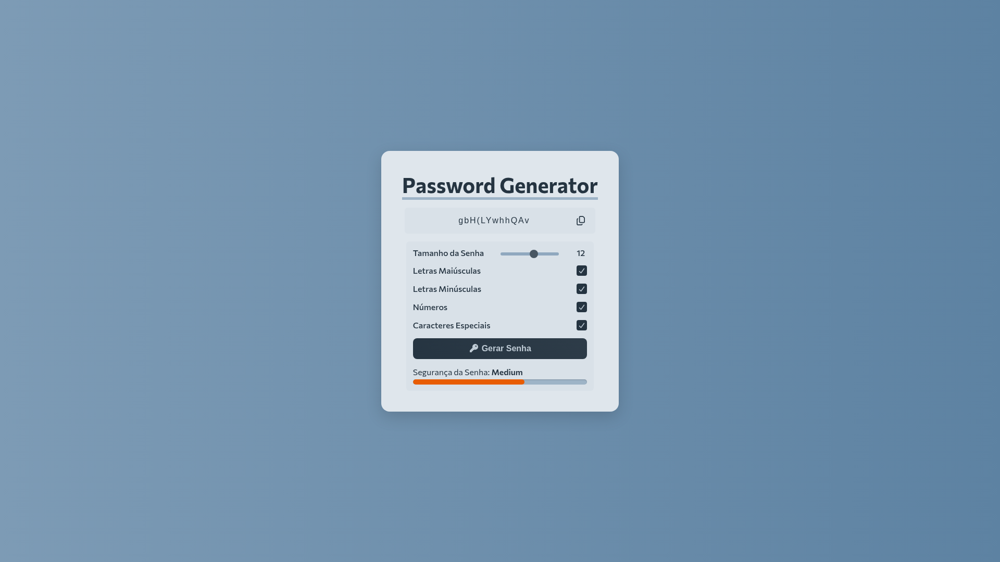

# Password Generator

Password Generator é um website com design simples e intuitivo, voltado para a criação de senhas seguras em que você poderá utilizar para o uso dos seus emails, contas, acessos a aplicativos e outros. Trazendo diversas opções de como você pode montar sua senha, junto de um medidor para auxiliar sua tomada de decisão.

---

## 🌐 Demonstração

Veja o projeto online:  
🔗 [Clique aqui para acessar o site](https://franciscodev011.github.io/Password-Generator/) 

## 📷 Preview



## 🔍 Tecnologias e Linguagens Utilizadas

- HTML5  
- CSS3  
- JAVASCRIPT

## 🧠 Lógica do Projeto

- O usuário define o tamanho da senha e caracteres que serão incluidos (números, simbolos, letras maiúsculas e minúsculas);
- O sistema verifica as opções selecionadas pelo usuário e agrupa os caracteres em uma única variável `allCharacters`; 
- A senha é gerada selecionando caracteres aleatórios do `allCharacters` até atingir o tamanho definido pelo usuário;
- O medidor calcula a segurança da senha com base no tamanho e variedade de caracteres através de uma pontuação;
- A senha gerada é exibida no campo de input, e permite o usuário copiar para a área de transferência.

## ✨ Funcionalidades

- Definição personalizada do tamanho da senha;
- Inclusão de letras maiúsculas;
- Inclusão de letras minúsculas;
- Inclusão de números;
- Inclusão de símbolos;
- Medidor de força da senha;
- Cópia para a área de transferência.

## 📚 O que Aprendi

- Estruturar a lógica de um algoritmo;
- Manipular elementos DOM usando Javascript;
- Utilizar operações condicionais (if e else) para verificação e cálculo;
- Trabalhar com laços de repetição;
- Aplicar conceito de aleatóriedade usando ```Math.random()```;
- Criação de interfaces com Flexbox;
- Melhorar a experiência de usuário através do feedback visual.